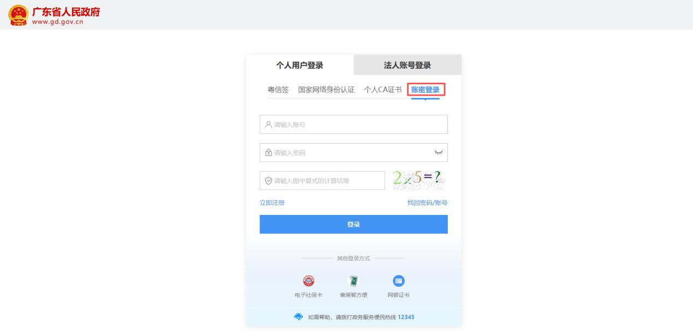

# 片段7：第4页 - 实名认证

## 图片

## 步骤说明
2.个人（自然人）账号密码登录 第一步：点击“账号密码”进入。

## 所在章节
- 章节：实名认证
- 页码：4/39

## 关键词
实名认证、密码、扫码、登录、账号

## 同页完整内容
（二）登录方式 1.实名认证登录 请您使用【微信】或者【支付宝】扫码登录。（登录后可在“账户安全”修 改账号名及密码） 2.个人（自然人）账号密码登录 第一步：点击“账号密码”进入。

---
fragment_id: 7
page: 4
section: 实名认证
has_image: True
keywords: 实名认证, 密码, 扫码, 登录, 账号
