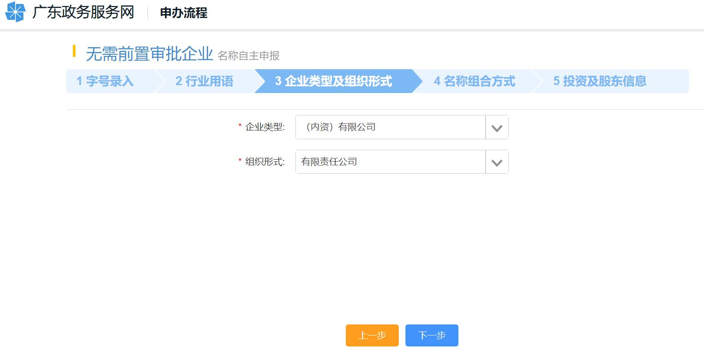

# 片段17：第10页 - 其他

## 图片

## 步骤说明
6. 企业类型及组织形式 选择相应的“企业类型”“组织形式”，点击“下一步”。

## 所在章节
- 章节：其他
- 页码：10/39

## 关键词
名称、组织形式、行业

## 同页完整内容
5. 行业用语 填写“行业用语”，点击“下一步”。 6. 企业类型及组织形式 选择相应的“企业类型”“组织形式”，点击“下一步”。 7. 名称组成方式 选择相应的“名称组合方式”，点击“下一步”。

---
fragment_id: 17
page: 10
section: 其他
has_image: True
keywords: 名称, 组织形式, 行业
