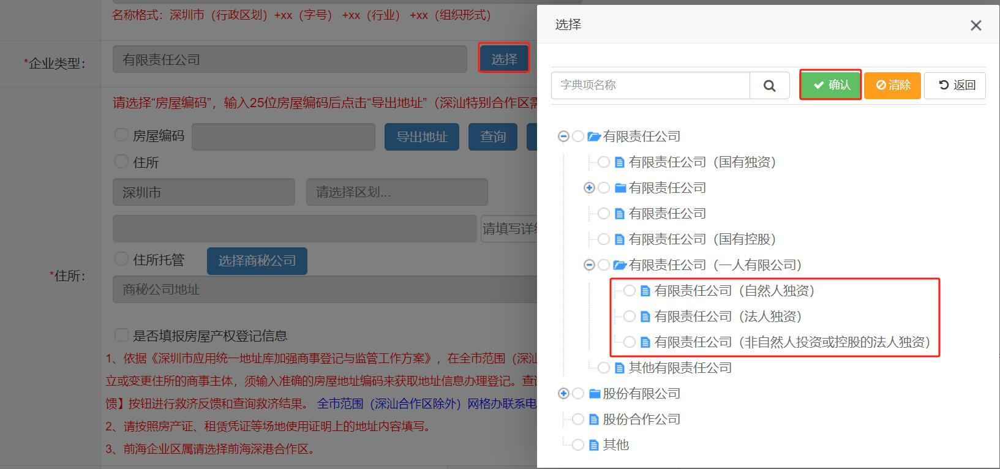

# 片段22：第13页 - 填写申请信息

## 图片

## 步骤说明
起名称自主申报流程； 2.企业类型（必选）：根据一人股东或多人股东对应选择； ①一人股东选择：有限责任公司（一人有限公司）操作如图。 ②多人股东选择：

## 所在章节
- 章节：填写申请信息
- 页码：13/39

## 关键词
名称、股东

## 同页完整内容
第三节 填写申请信息 名称自主申报完成后跳转到公司设立登记页面，操作如下： 1. 基本信息 填写页面基础信息，点击“下一步”。 注意事项： 1.企业名称：不予修改，如需修改请点击页面右上角“删除”业务，重新发 起名称自主申报流程； 2.企业类型（必选）：根据一人股东或多人股东对应选择； ①一人股东选择：有限责任公司（一人有限公司）操作如图。 ②多人股东选择：

---
fragment_id: 22
page: 13
section: 填写申请信息
has_image: True
keywords: 名称, 股东
