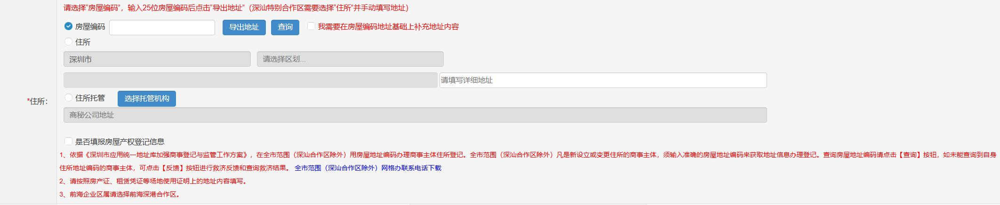

# 片段24：第14页 - 其他

## 图片

## 步骤说明
③其他企业类型自行如以上操作流程选择即可。 3.住所：请选择“房屋编码”，输入25 位房屋编码后点击“导出地址”（深 汕特别合作区需要选择“住所”并手动填写地址）。

## 所在章节
- 章节：其他
- 页码：14/39

## 关键词
住所、房屋编码、注册、注册资本、经营期限

## 同页完整内容
③其他企业类型自行如以上操作流程选择即可。 3.住所：请选择“房屋编码”，输入25 位房屋编码后点击“导出地址”（深 汕特别合作区需要选择“住所”并手动填写地址）。 注意事项： 1.认缴注册资本总额：单位为“万元”人民币；注意：只填写数字，不能填 写文字； 2.经营期限：默认“永续经营”，如果是具体年数，请取消选中永续经营。

---
fragment_id: 24
page: 14
section: 其他
has_image: True
keywords: 住所, 房屋编码, 注册, 注册资本, 经营期限
