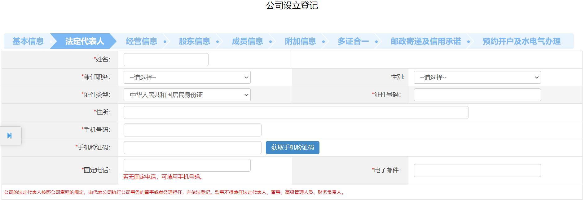

# 片段27：第15页 - 其他

## 图片

## 步骤说明
2. 法定代表人 填写法定代表人信息，点击“下一步”。 注意事项：

## 所在章节
- 章节：其他
- 页码：15/39

## 关键词
法定代表人、监事、经营范围、股东、董事、财务

## 同页完整内容
2. 法定代表人 填写法定代表人信息，点击“下一步”。 注意事项： 1.兼任职务：公司的法定代表人按照公司章程的规定，由代表公司执行公司 事务的董事或者经理担任，并依法登记。监事不得兼任法定代表人、董事、高级 管理人员、财务负责人。 2.手机号码不允许填写虚拟电话。 3. 经营信息 第一步：点击左侧“经营范围标准填报”按钮，填报经营范围。 第二步：选择“是否预付费经营”等信息，点击“下一步”。 4. 股东信息 第一步：点击“增加”，增加股东信息，点击“下一步”。

---
fragment_id: 27
page: 15
section: 其他
has_image: True
keywords: 法定代表人, 监事, 经营范围, 股东, 董事, 财务
