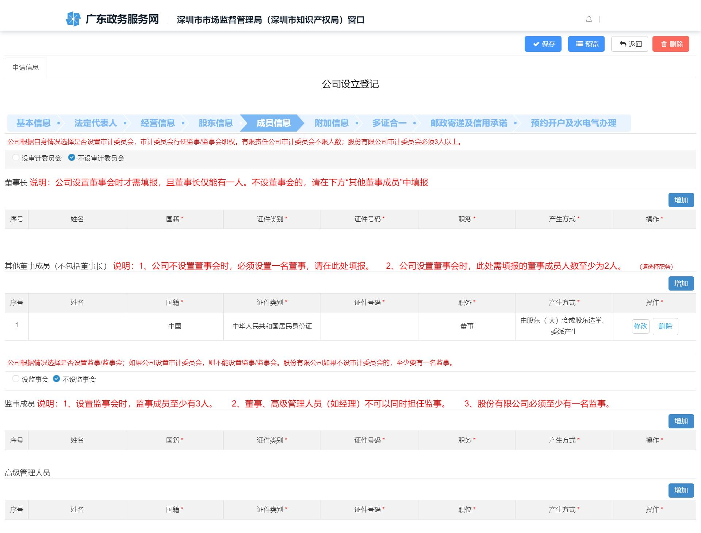

# 片段30：第16页 - 其他

## 图片

## 步骤说明
5. 成员信息 根据企业实际情况，填报成员信息，点击“下一步”。 注意事项：

## 所在章节
- 章节：其他
- 页码：16/39

## 关键词
名称、监事、股东

## 同页完整内容
注意事项： 1.股东人数需根据【基本信息】企业类型选择事项相对应，如选择一人有限 公司，股东为1 人；如选择“有限公司”或“有限责任公司”，股东应为2 人或 多人。 2.股东的出资总额需等于【基本信息】的认缴出资总额。例如：认缴出资额 为10 万，股东为2 人，2 人的出资额相加需为10 万。 3.股东属性：“自然人”不区分国籍；“本地企业”为深圳企业，输入统一 社会信用代码和企业名称，点击查询，系统自动带出企业信息；“其他投资者” 为外地企业； 5. 成员信息 根据企业实际情况，填报成员信息，点击“下一步”。 注意事项： 1.公司根据自身情况选择是否设置审计委员会，审计委员会行使监事/监事 会职权。有限责任公司审计委员会不限人数；股份有限公司审计委员会必须3

---
fragment_id: 30
page: 16
section: 其他
has_image: True
keywords: 名称, 监事, 股东
