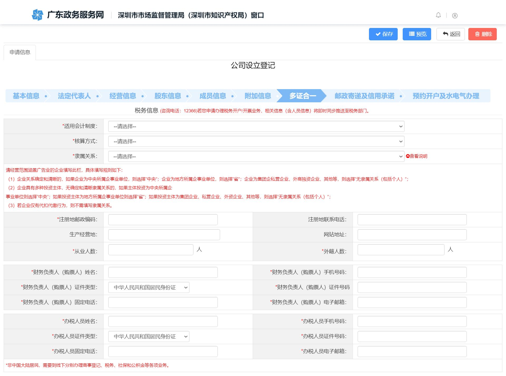

# 片段32：第18页 - 其他

## 图片

## 步骤说明
7. 多证合 第一步：填写“税务信息（咨询电话12366）”，相关财务负责人（购票人） 信息、办税人员信息系统自动带出。 如需购票请务必勾选“是否使用发票”此项，勾选一般纳税人登记、领用发

## 所在章节
- 章节：其他
- 页码：18/39

## 关键词
党建、刻章、印章、发票、社保、税务、财务

## 同页完整内容
7. 多证合一 第一步：填写“税务信息（咨询电话12366）”，相关财务负责人（购票人） 信息、办税人员信息系统自动带出。 如需购票请务必勾选“是否使用发票”此项，勾选一般纳税人登记、领用发 票信息二项信息至少填写一项。 第二步：填写“党建信息”。 第三步：填写“公安信息(咨询电话：84449378)”，选择“是否免费刻章”， 如需免费刻章印章选择“是”。 第四步：填写“社保信息(咨询电话：12333)”，可自行选择是否申请。如

---
fragment_id: 32
page: 18
section: 其他
has_image: True
keywords: 党建, 刻章, 印章, 发票, 社保, 税务, 财务
