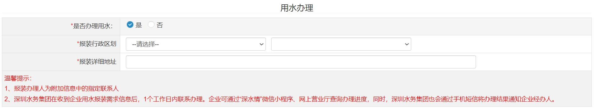

# 片段41：第20页 - 其他

## 图片

## 步骤说明
第三步：选择企业是否办理“用水”、“用电”、“用气”，选择“是”需 填写相关水电气报装信息。

## 所在章节
- 章节：其他
- 页码：20/39

## 关键词
公积金、开户、水电气、社保、税务、银行、预约

## 同页完整内容
方式进行缴付。 9. 预约银行开户及水电气办理 第一步：选择是否预约银行开户服务，如选择“是”，请选择是否预约银行 开户并签订三方协议，如选择“是”，请选择是“否使用预约开户账户代扣税务 和社保”、“是否使用预约账户代扣住房公积金”。 第二步：选择是否预约银行开户服务，如选择“是”，请选择预约开户办理 的银行机构和网点。 第三步：选择企业是否办理“用水”、“用电”、“用气”，选择“是”需 填写相关水电气报装信息。

---
fragment_id: 41
page: 20
section: 其他
has_image: True
keywords: 公积金, 开户, 水电气, 社保, 税务, 银行, 预约
