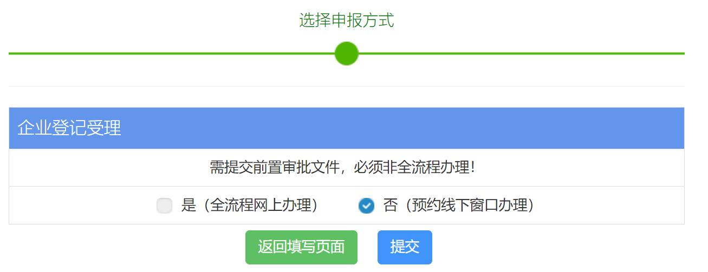

# 片段55：第27页 - 流程办理方式

## 图片

## 步骤说明
2. 非全流程办理方式 第一步：非全流程办理，选择“否（预约线下窗口办理）”，点击“提交”。

## 所在章节
- 章节：流程办理方式
- 页码：27/39

## 关键词
预约

---
fragment_id: 55
page: 27
section: 流程办理方式
has_image: True
keywords: 预约
