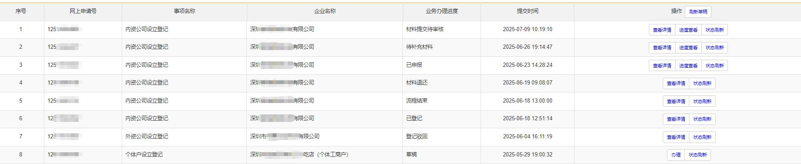

# 片段66：第33页 - 业务审核

## 图片

## 步骤说明
(6) 审批通过 状态显示为：已登记。可领取营业执照。 2 领取营业执照

## 所在章节
- 章节：业务审核
- 页码：33/39

## 关键词
审核、法定代表人、注册、登录、营业执照、补充材料、身份证、邮寄、领证、驳回

## 同页完整内容
第六节 业务审核 1. 业务审核结果 经办人可登录登记注册系统个人中心查询业务审核进度，最新状态对应以下 情况： (1) “未提交”状态显示为：草稿； (2) 全流程业务“已提交待审核”状态显示为：材料提交待审核； (3) 非全流程业务“已提交待审核”状态显示为：已申报； (4) 全流程业务“需要前往窗口补充材料”状态显示为：待补充材料； (5) “驳回”状态显示为：已登记驳回。业务被驳回，不能删除或修改原申请业 务，需要根据驳回意见重新发起申请； (6) “审批通过”状态显示为：已登记。可领取营业执照。 2. 领取营业执照 新设立的一窗通内资有限公司或内资有限责任公司，通过“自助领证”、“窗 口领证”、“邮寄领证”对应方式领取营业执照。 (1) 自助领证 1) 领证人 业务经办人或法定代表人（需携带身份证件原件）； 2) 全市营业执照自助领证点 查看商事主体营业执照领证指南，查询网址： https://www.sist.org.cn/fwzl/Daima/ywfw/bszn/dzhyzzff/201904/t2019041 0_2246565.html (2) 窗口领证

---
fragment_id: 66
page: 33
section: 业务审核
has_image: True
keywords: 审核, 法定代表人, 注册, 登录, 营业执照, 补充材料, 身份证, 邮寄, 领证, 驳回
