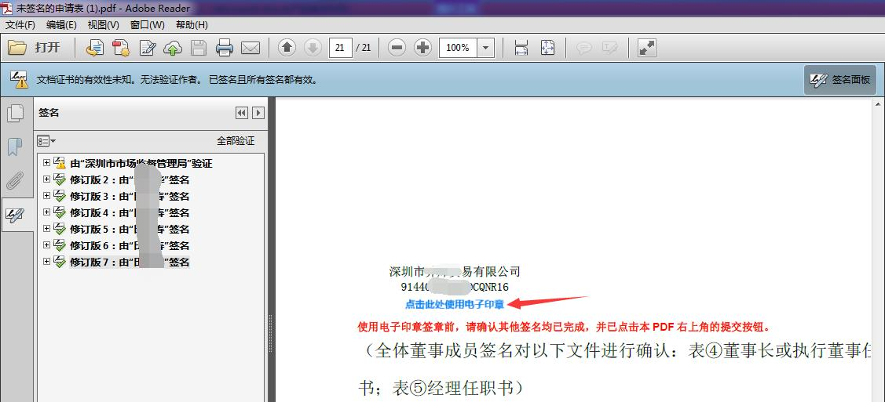

# 片段73：第37页 - 电子印章

## 图片

## 步骤说明
图1

## 所在章节
- 章节：电子印章
- 页码：37/39

## 关键词
印章、扫码、电子印章、签名

## 同页完整内容
图1 图2 2.具体签名步骤 （1）在线签章：打开深圳市统一电子印章管理系统网站（地址： https://amr.sz.gov.cn/elecseal/seal-web/#/home），选择【在线签章】栏目， 确认签章文件与签章位置后，打开“i 深圳”APP—【部门服务】—【市市场监 督管理局】—【政务服务】—【电子印章服务】—【扫码签章】扫描二维码确认

---
fragment_id: 73
page: 37
section: 电子印章
has_image: True
keywords: 印章, 扫码, 电子印章, 签名
