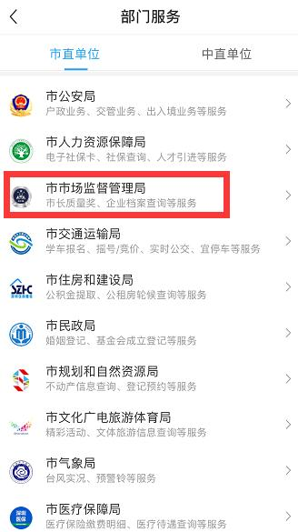

# 片段76：第38页 - 电子印章

## 图片

## 步骤说明
签章。 （2）本地签章：下载“电子印章客户端”软件，确认签章文件与签章位置 后，再用“i 深圳”APP【扫码签章】。 1 2

## 所在章节
- 章节：电子印章
- 页码：38/39

## 关键词
印章、扫码、电子印章

## 同页完整内容
签章。 （2）本地签章：下载“电子印章客户端”软件，确认签章文件与签章位置 后，再用“i 深圳”APP【扫码签章】。 1 2 3 4

---
fragment_id: 76
page: 38
section: 电子印章
has_image: True
keywords: 印章, 扫码, 电子印章
