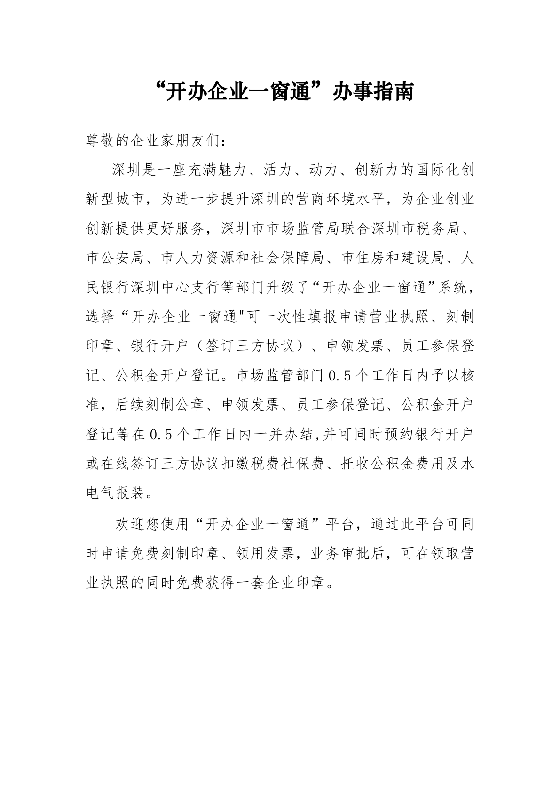

# 第1页：封面

## 整页截图

## OCR识别内容

“开办企业一窗通”办事指南
尊敬的企业家朋友们：
深圳是一座充满魅力、活力、动力、创新力的国际化创
新型城市，为进一步提升深圳的营商环境水平，为企业创业
创新提供更好服务，深圳市市场监管局联合深圳市税务局、
市公安局、市人力资源和社会保障局、市住房和建设局、人
民银行深圳中心支行等部门升级了“开办企业一窗通”系统，
选择“开办企业一窗通"可一次性填报申请营业执照、刻制
印章、银行开户（签订三方协议）、申领发票、员工参保登
记、公积金开户登记。市场监管部门0.5 个工作日内予以核
准，后续刻制公章、申领发票、员工参保登记、公积金开户
登记等在0.5 个工作日内一并办结,并可同时预约银行开户
或在线签订三方协议扣缴税费社保费、托收公积金费用及水
电气报装。
欢迎您使用“开办企业一窗通”平台，通过此平台可同
时申请免费刻制印章、领用发票，业务审批后，可在领取营
业执照的同时免费获得一套企业印章。

---

**页码**：1/39
**页面类型**：封面
**图片数量**：0
