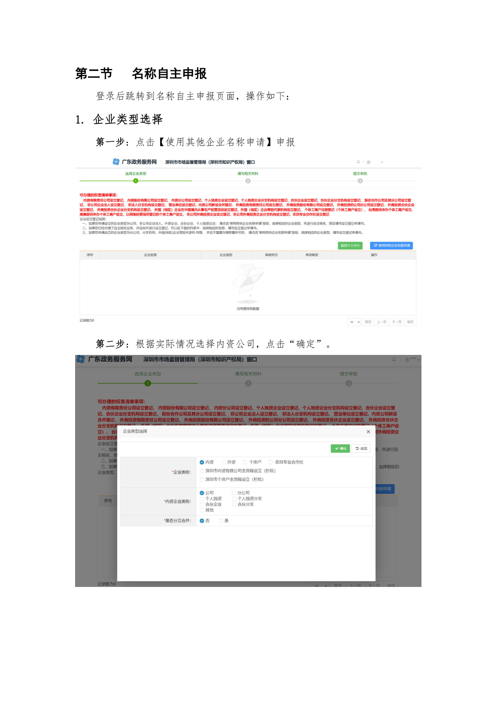
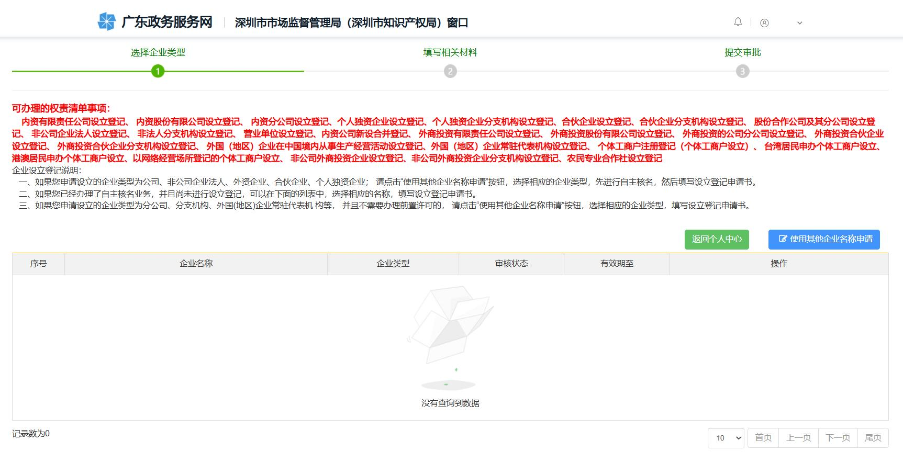
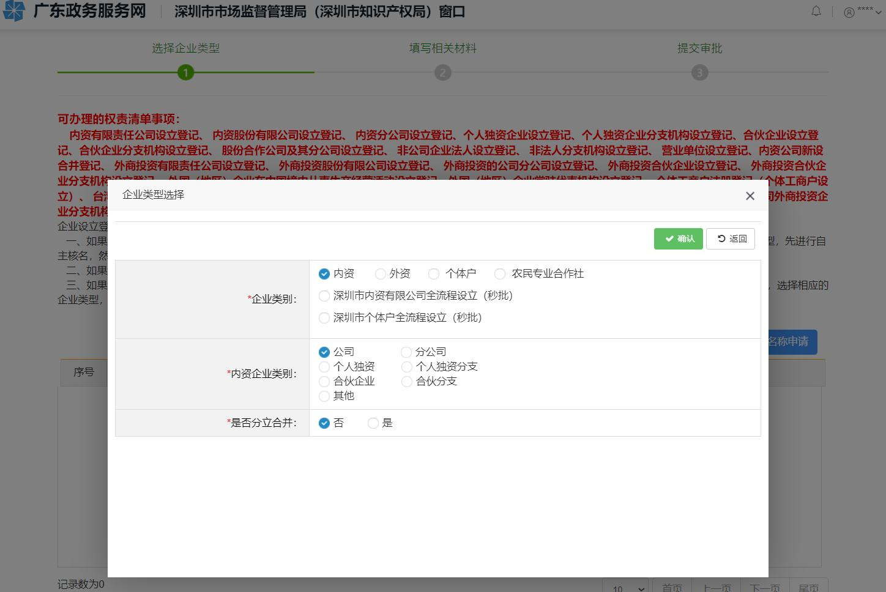

# 第7页：名称自主申报

## 整页截图

## 本页包含 2 张图片

### 图片 1

### 图片 2

## OCR识别内容

第二节
名称自主申报
登录后跳转到名称自主申报页面，操作如下：
1. 企业类型选择
第一步：点击【使用其他企业名称申请】申报
第二步：根据实际情况选择内资公司，点击“确定”。

---

**页码**：7/39
**页面类型**：名称自主申报
**图片数量**：2
