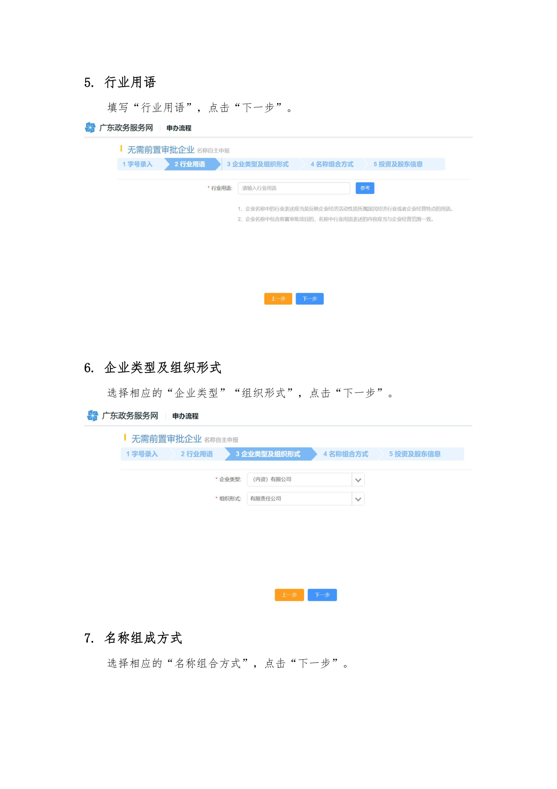
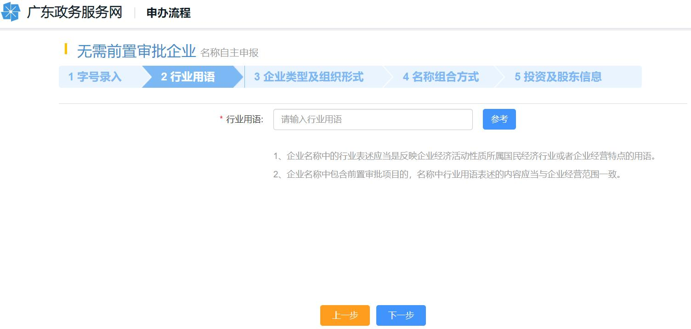

# 第10页：行业用语

## 整页截图

## 本页包含 2 张图片

### 图片 1

### 图片 2

## OCR识别内容

5. 行业用语
填写“行业用语”，点击“下一步”。
6. 企业类型及组织形式
选择相应的“企业类型”“组织形式”，点击“下一步”。
7. 名称组成方式
选择相应的“名称组合方式”，点击“下一步”。

---

**页码**：10/39
**页面类型**：行业用语
**图片数量**：2
