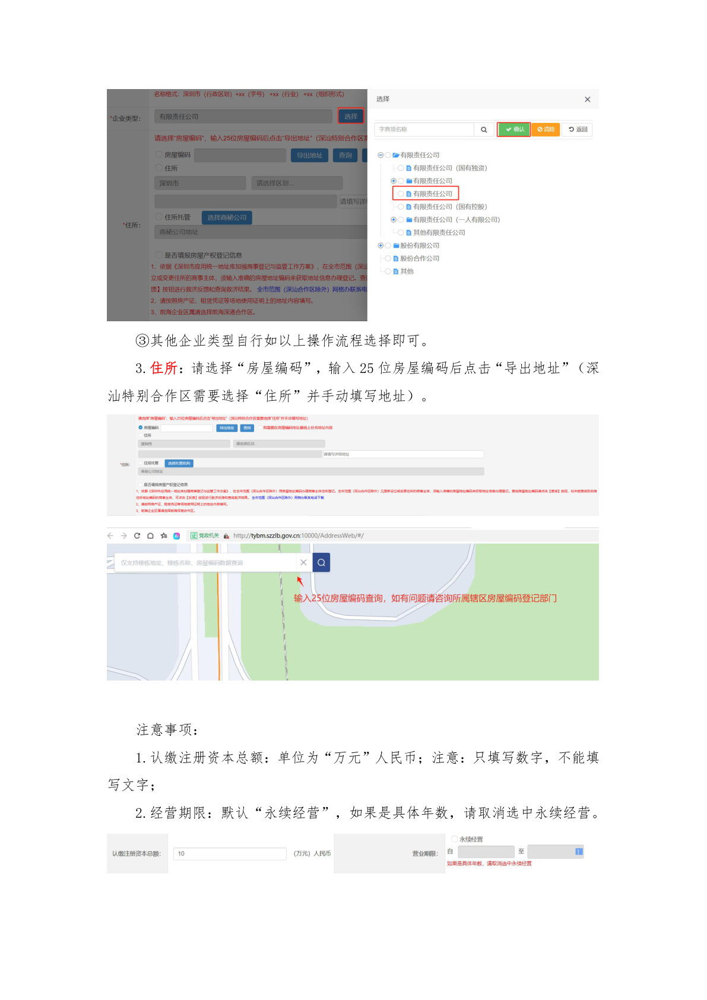
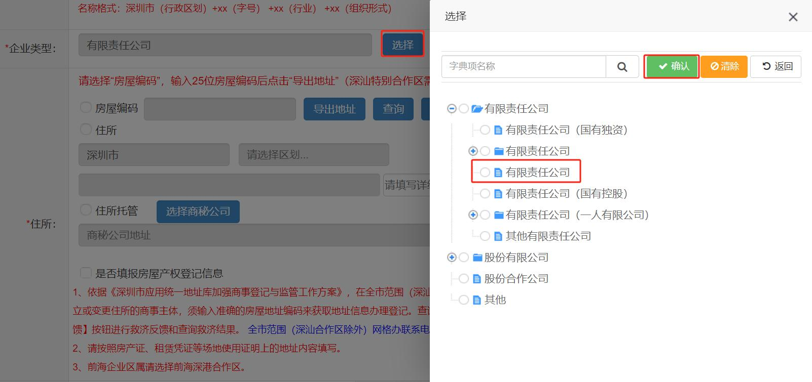
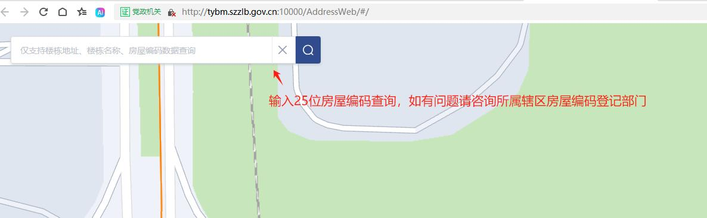
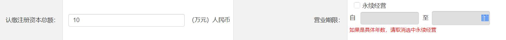

# 第14页：基本信息

## 整页截图

## 本页包含 4 张图片

### 图片 1

### 图片 2

### 图片 3

### 图片 4

## OCR识别内容

③其他企业类型自行如以上操作流程选择即可。
3.住所：请选择“房屋编码”，输入25 位房屋编码后点击“导出地址”（深
汕特别合作区需要选择“住所”并手动填写地址）。
注意事项：
1.认缴注册资本总额：单位为“万元”人民币；注意：只填写数字，不能填
写文字；
2.经营期限：默认“永续经营”，如果是具体年数，请取消选中永续经营。

---

**页码**：14/39
**页面类型**：基本信息
**图片数量**：4
