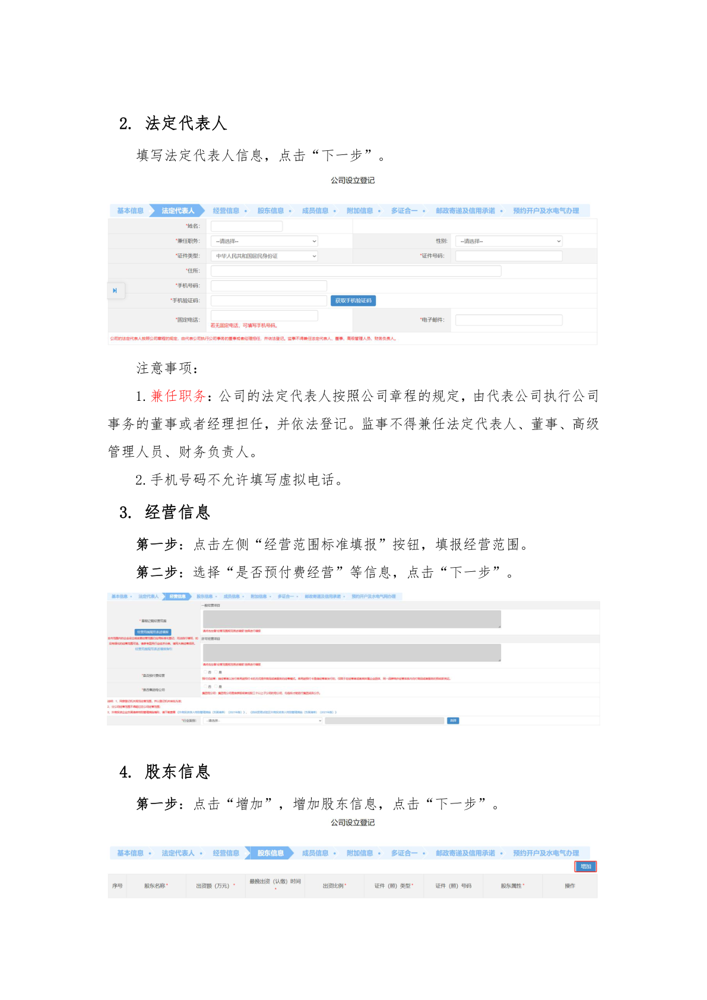
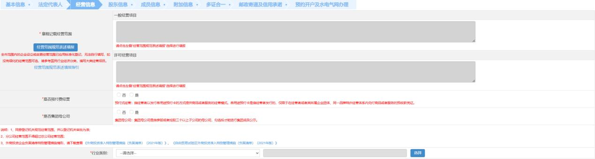
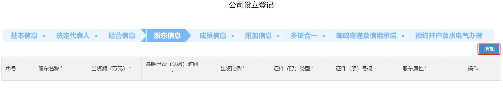

# 第15页：法定代表人

## 整页截图

## 本页包含 3 张图片

### 图片 1

### 图片 2

### 图片 3

## OCR识别内容

2. 法定代表人
填写法定代表人信息，点击“下一步”。
注意事项：
1.兼任职务：公司的法定代表人按照公司章程的规定，由代表公司执行公司
事务的董事或者经理担任，并依法登记。监事不得兼任法定代表人、董事、高级
管理人员、财务负责人。
2.手机号码不允许填写虚拟电话。
3. 经营信息
第一步：点击左侧“经营范围标准填报”按钮，填报经营范围。
第二步：选择“是否预付费经营”等信息，点击“下一步”。
4. 股东信息
第一步：点击“增加”，增加股东信息，点击“下一步”。

---

**页码**：15/39
**页面类型**：法定代表人
**图片数量**：3
