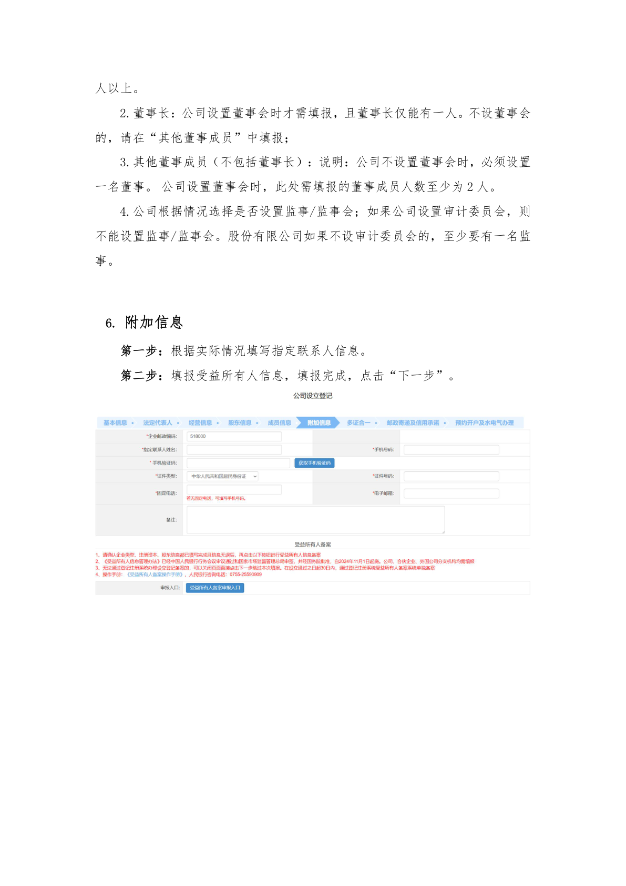
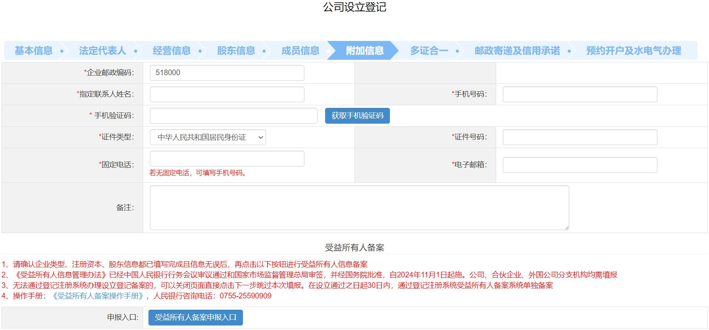

# 第17页：成员信息

## 整页截图

## 本页包含 1 张图片

### 图片 1

## OCR识别内容

人以上。
2.董事长：公司设置董事会时才需填报，且董事长仅能有一人。不设董事会
的，请在“其他董事成员”中填报；
3.其他董事成员（不包括董事长）：说明：公司不设置董事会时，必须设置
一名董事。公司设置董事会时，此处需填报的董事成员人数至少为2 人。
4.公司根据情况选择是否设置监事/监事会；如果公司设置审计委员会，则
不能设置监事/监事会。股份有限公司如果不设审计委员会的，至少要有一名监
事。
6. 附加信息
第一步：根据实际情况填写指定联系人信息。
第二步：填报受益所有人信息，填报完成，点击“下一步”。

---

**页码**：17/39
**页面类型**：成员信息
**图片数量**：1
