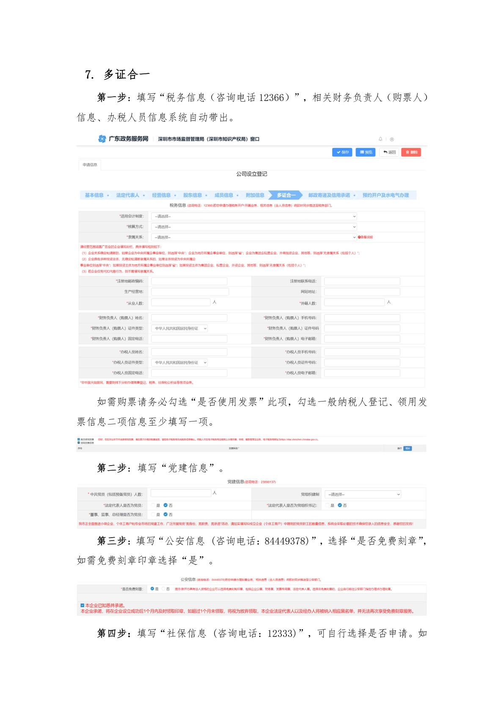
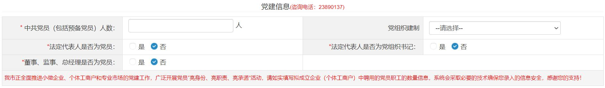
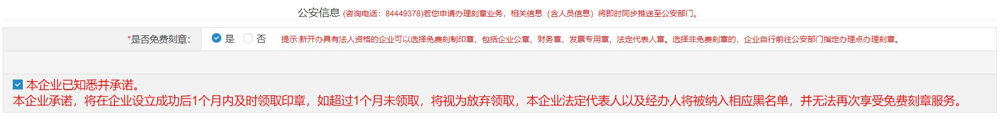

# 第18页：多证合一

## 整页截图

## 本页包含 4 张图片

### 图片 1

### 图片 2

### 图片 3

### 图片 4

## OCR识别内容

7. 多证合一
第一步：填写“税务信息（咨询电话12366）”，相关财务负责人（购票人）
信息、办税人员信息系统自动带出。
如需购票请务必勾选“是否使用发票”此项，勾选一般纳税人登记、领用发
票信息二项信息至少填写一项。
第二步：填写“党建信息”。
第三步：填写“公安信息(咨询电话：84449378)”，选择“是否免费刻章”，
如需免费刻章印章选择“是”。
第四步：填写“社保信息(咨询电话：12333)”，可自行选择是否申请。如

---

**页码**：18/39
**页面类型**：多证合一
**图片数量**：4
