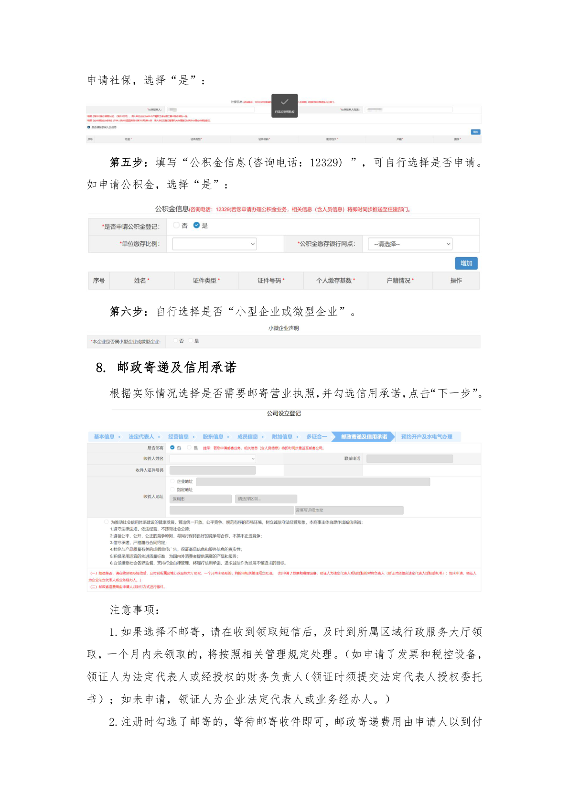
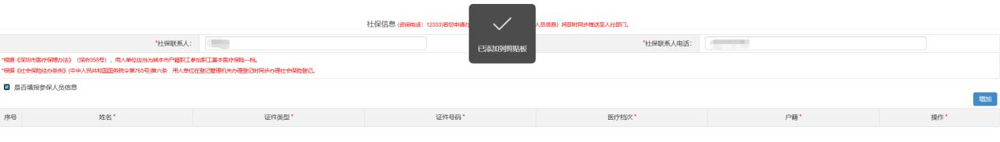
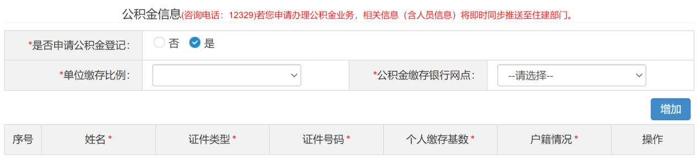
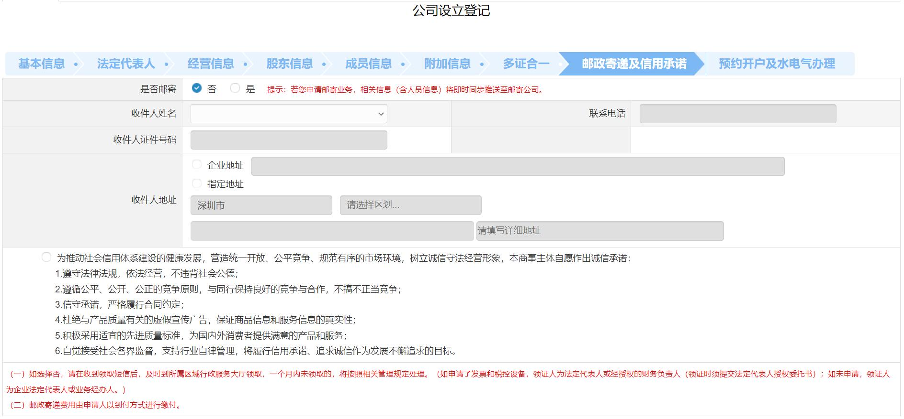

# 第19页：法定代表人

## 整页截图

## 本页包含 4 张图片

### 图片 1

### 图片 2

### 图片 3

### 图片 4

## OCR识别内容

申请社保，选择“是”：
第五步：填写“公积金信息(咨询电话：12329) ”，可自行选择是否申请。
如申请公积金，选择“是”：
第六步：自行选择是否“小型企业或微型企业”。
8. 邮政寄递及信用承诺
根据实际情况选择是否需要邮寄营业执照，并勾选信用承诺，点击“下一步”。
注意事项：
1.如果选择不邮寄，请在收到领取短信后，及时到所属区域行政服务大厅领
取，一个月内未领取的，将按照相关管理规定处理。（如申请了发票和税控设备，
领证人为法定代表人或经授权的财务负责人（领证时须提交法定代表人授权委托
书）；如未申请，领证人为企业法定代表人或业务经办人。）
2.注册时勾选了邮寄的，等待邮寄收件即可，邮政寄递费用由申请人以到付

---

**页码**：19/39
**页面类型**：法定代表人
**图片数量**：4
