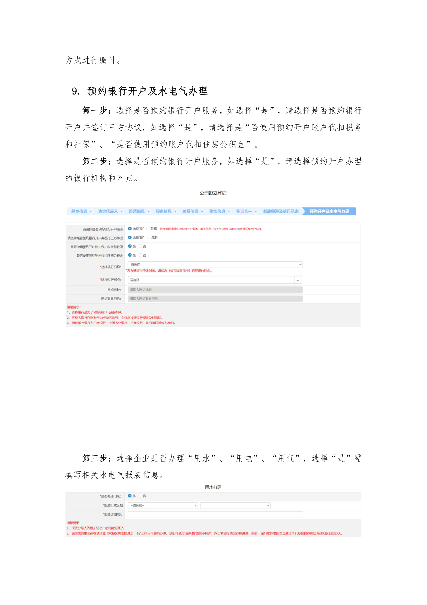
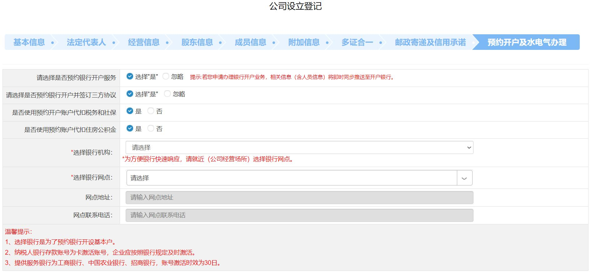

# 第20页：其他内容

## 整页截图

## 本页包含 2 张图片

### 图片 1

### 图片 2

## OCR识别内容

方式进行缴付。
9. 预约银行开户及水电气办理
第一步：选择是否预约银行开户服务，如选择“是”，请选择是否预约银行
开户并签订三方协议，如选择“是”，请选择是“否使用预约开户账户代扣税务
和社保”、“是否使用预约账户代扣住房公积金”。
第二步：选择是否预约银行开户服务，如选择“是”，请选择预约开户办理
的银行机构和网点。
第三步：选择企业是否办理“用水”、“用电”、“用气”，选择“是”需
填写相关水电气报装信息。

---

**页码**：20/39
**页面类型**：其他内容
**图片数量**：2
