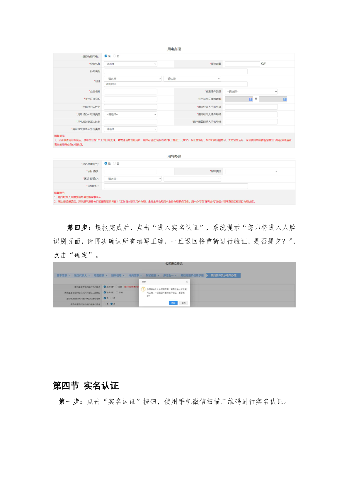
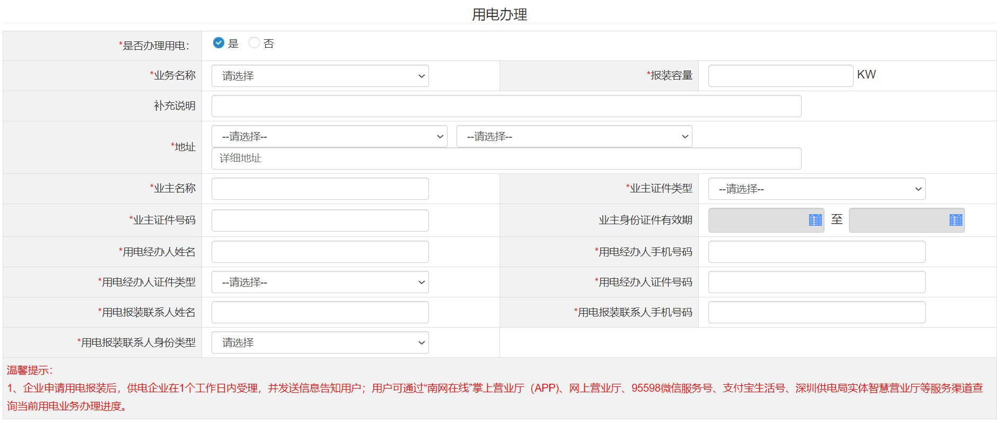

# 第21页：实名认证

## 整页截图

## 本页包含 3 张图片

### 图片 1

### 图片 2

### 图片 3

## OCR识别内容

第四步：填报完成后，点击“进入实名认证”，系统提示“您即将进入人脸
识别页面，请再次确认所有填写正确，一旦返回将重新进行验证，是否提交？”，
点击“确定”。
第四节实名认证
第一步：点击“实名认证”按钮，使用手机微信扫描二维码进行实名认证。

---

**页码**：21/39
**页面类型**：实名认证
**图片数量**：3
