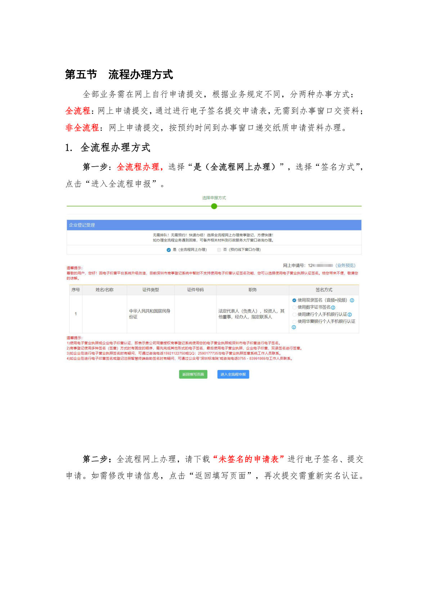
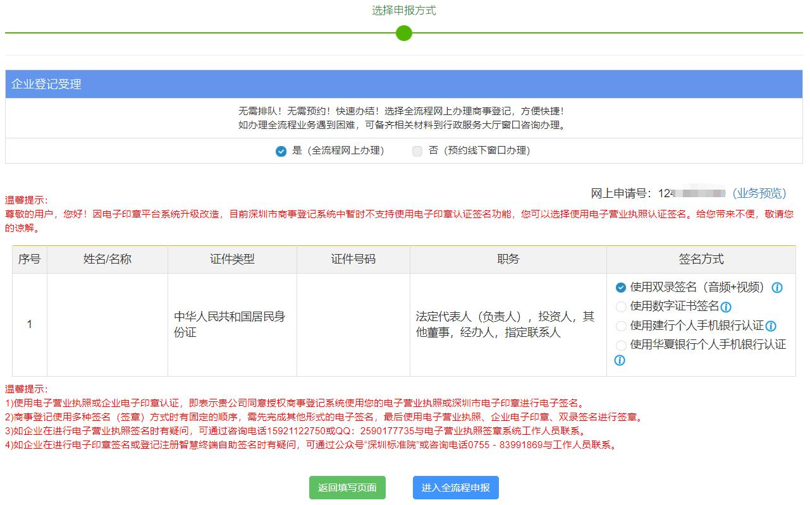

# 第24页：实名认证

## 整页截图

## 本页包含 1 张图片

### 图片 1

## OCR识别内容

第五节
流程办理方式
全部业务需在网上自行申请提交，根据业务规定不同，分两种办事方式：
全流程：网上申请提交，通过进行电子签名提交申请表，无需到办事窗口交资料；
非全流程：网上申请提交，按预约时间到办事窗口递交纸质申请资料办理。
1. 全流程办理方式
第一步：全流程办理，选择“是（全流程网上办理）”，选择“签名方式”，
点击“进入全流程申报”。
第二步：全流程网上办理，请下载“未签名的申请表”进行电子签名、提交
申请。如需修改申请信息，点击“返回填写页面”，再次提交需重新实名认证。

---

**页码**：24/39
**页面类型**：实名认证
**图片数量**：1
