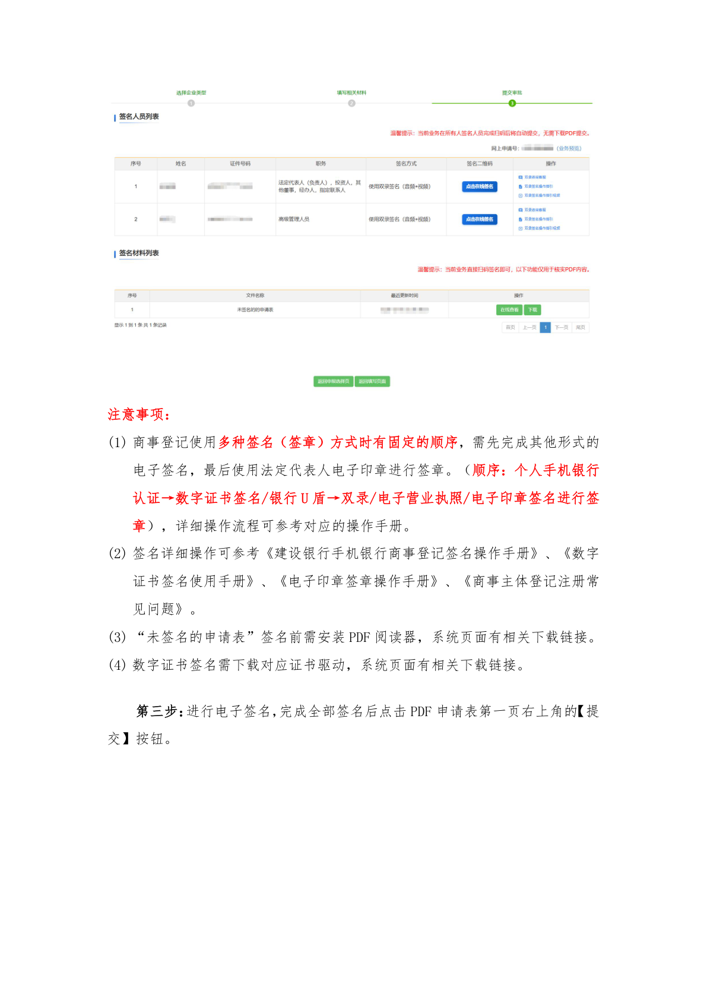
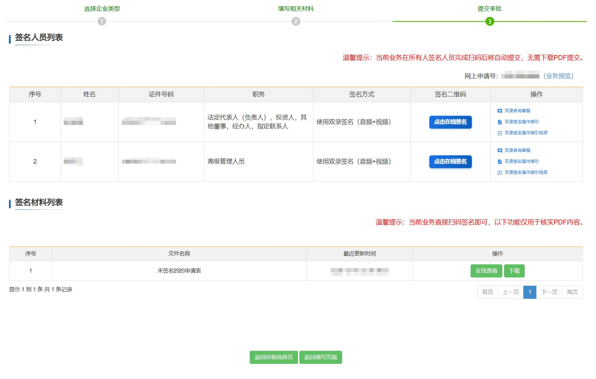

# 第25页：法定代表人

## 整页截图

## 本页包含 1 张图片

### 图片 1

## OCR识别内容

注意事项：
(1) 商事登记使用多种签名（签章）方式时有固定的顺序，需先完成其他形式的
电子签名，最后使用法定代表人电子印章进行签章。（顺序：个人手机银行
认证→数字证书签名/银行U 盾→双录/电子营业执照/电子印章签名进行签
章），详细操作流程可参考对应的操作手册。
(2) 签名详细操作可参考《建设银行手机银行商事登记签名操作手册》、《数字
证书签名使用手册》、《电子印章签章操作手册》、《商事主体登记注册常
见问题》。
(3) “未签名的申请表”签名前需安装PDF 阅读器，系统页面有相关下载链接。
(4) 数字证书签名需下载对应证书驱动，系统页面有相关下载链接。
第三步：进行电子签名，完成全部签名后点击PDF 申请表第一页右上角的【提
交】按钮。

---

**页码**：25/39
**页面类型**：法定代表人
**图片数量**：1
