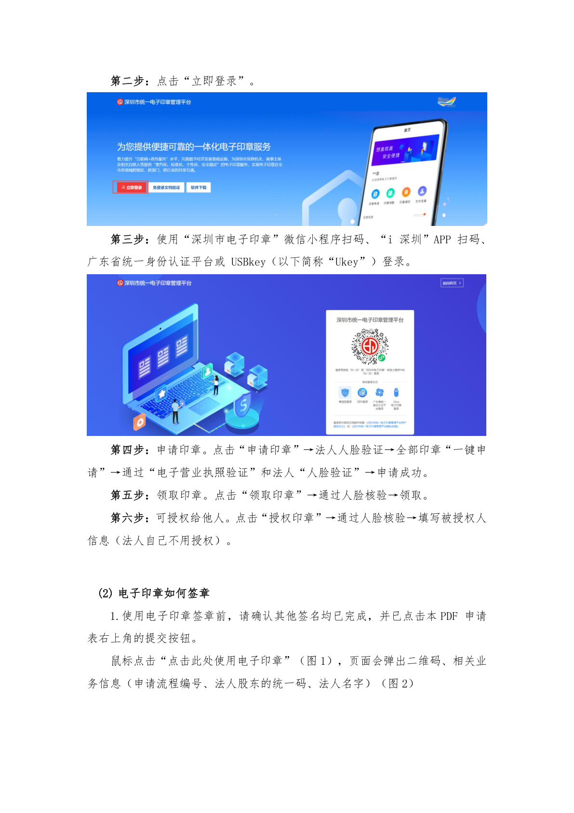

# 第36页：电子印章

## 整页截图

## 本页包含 2 张图片

### 图片 1

### 图片 2

## OCR识别内容

第二步：点击“立即登录”。
第三步：使用“深圳市电子印章”微信小程序扫码、“i 深圳”APP 扫码、
广东省统一身份认证平台或USBkey（以下简称“Ukey”）登录。
第四步：申请印章。点击“申请印章”→法人人脸验证→全部印章“一键申
请”→通过“电子营业执照验证”和法人“人脸验证”→申请成功。
第五步：领取印章。点击“领取印章”→通过人脸核验→领取。
第六步：可授权给他人。点击“授权印章”→通过人脸核验→填写被授权人
信息（法人自己不用授权）。
(2) 电子印章如何签章
1.使用电子印章签章前，请确认其他签名均已完成，并已点击本PDF 申请
表右上角的提交按钮。
鼠标点击“点击此处使用电子印章”（图1），页面会弹出二维码、相关业
务信息（申请流程编号、法人股东的统一码、法人名字）（图2）

---

**页码**：36/39
**页面类型**：电子印章
**图片数量**：2
