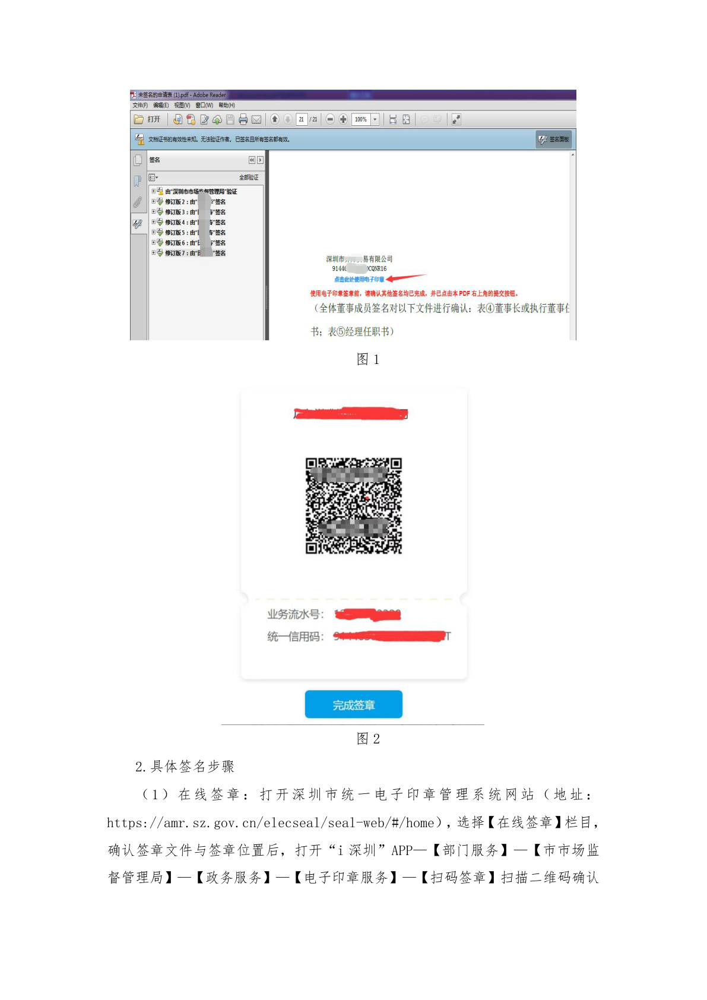
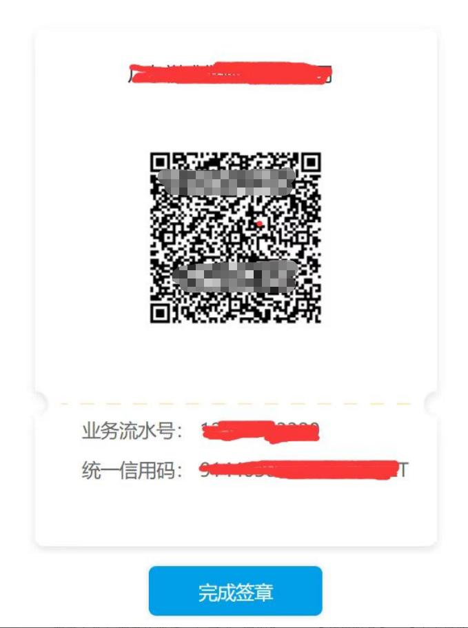

# 第37页：电子印章

## 整页截图

## 本页包含 2 张图片

### 图片 1

### 图片 2

## OCR识别内容

图1
图2
2.具体签名步骤
（1）在线签章：打开深圳市统一电子印章管理系统网站（地址：
https://amr.sz.gov.cn/elecseal/seal-web/#/home），选择【在线签章】栏目，
确认签章文件与签章位置后，打开“i 深圳”APP—【部门服务】—【市市场监
督管理局】—【政务服务】—【电子印章服务】—【扫码签章】扫描二维码确认

---

**页码**：37/39
**页面类型**：电子印章
**图片数量**：2
