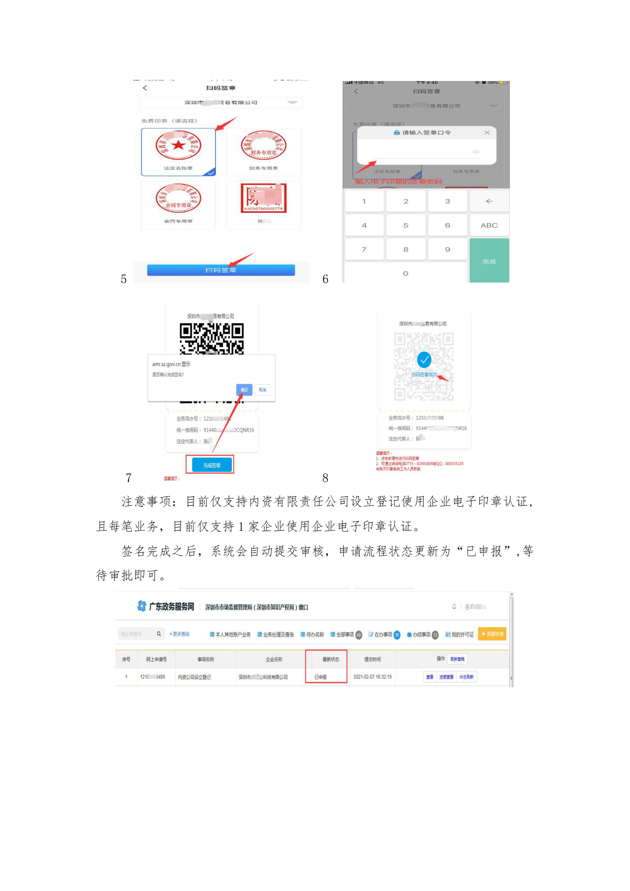
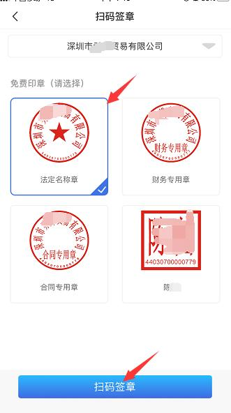
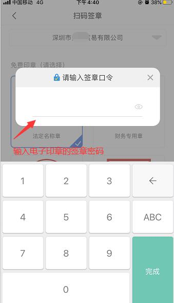
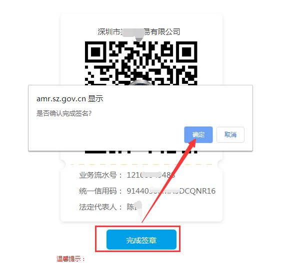
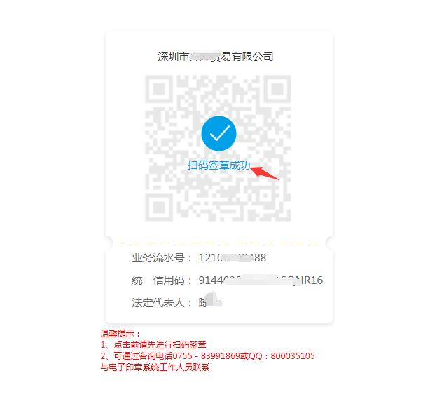
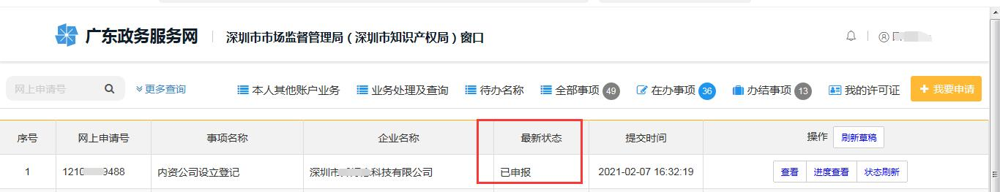

# 第39页：填写申请信息

## 整页截图

## 本页包含 5 张图片

### 图片 1

### 图片 2

### 图片 3

### 图片 4

### 图片 5

## OCR识别内容

5
6
7
8
注意事项：目前仅支持内资有限责任公司设立登记使用企业电子印章认证,
且每笔业务，目前仅支持1 家企业使用企业电子印章认证。
签名完成之后，系统会自动提交审核，申请流程状态更新为“已申报”,等
待审批即可。

---

**页码**：39/39
**页面类型**：填写申请信息
**图片数量**：5
